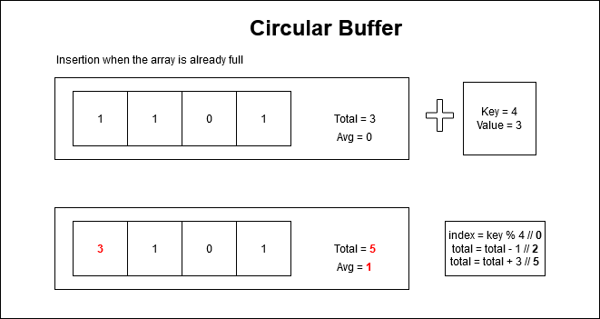

# Datadog Take Home
This project is my (Olivier Solliec) take home assignment for my datadog application. I wrote it in C# and included a dockerfile for easy running. Here are the guidelines for reference: [guidelines](https://docs.google.com/document/d/1NtnYypfuhRIllsh99Aq1inbLBytVIDvhmiWbKwGy7ug/edit#).

# How to run

## Using docker

## Not using docker

# Design Considerations

## Libraries

I use [CsvHelper](https://joshclose.github.io/CsvHelper/) for parsing the CSV file. My reasoning is the following:
- Don't reinvent the wheel
- I don't want to spend too much time with CSV edge cases (line breaks inside quotes, escaped quote inside quotes ...)
- I will focus on the actual added value of this take home, the monitoring/alerting system.

I use [XUnit](https://xunit.net/) for unit/integration tests.

## Assumptions

### Ten seconds summary

I'm assuming that we should handle low traffic websites, and that we won't necessarily have every second in the timestamps of the logs. 

I allow the summary to take more time than ten seconds in those cases.

For example, if I receive the following timestamps : [1, 5, 23], the first message will be triggered at timestamp 23, and the window will be larger than ten seconds.

### Two minutes average alert

I'm assuming the first two minutes of the alert life we can't fire the alert because we don't have enough data about it.

### Allowing for (slightly) late events

We can't be sure that while streaming the results into our program, we will receive all our events in order. That's why our design should allow for receiving late events. However, we must also be reasonable and have a limit at how far back we can ingest late events.

Here, for the 10 seconds statistics system, I'm assuming that it is okay to ignore events that are later than 10 seconds.

Likewise for the 120 seconds alerting system, we won't register events later than 120 seconds.

### Granularity of the system

I'm assuming that it's okay for the system to have a granularity to the second - the epoch timestamp in the sample csv file is up to the second anyway.

## Architecture

- The **StreamingCsvParser** is the class responsible for reading the file / stdin input line by line.
- The **Orchestrator** is responsible for the passage of time and will keep the latest seen timestamp so far. It will pass this along with the parsed csv lines to its list of ILogAggregator.
- The **ILogAggregator** is the interface that both alerts and reports must extend to fit in the program
- The **AverageHitAlert** class is the single alert implemented to fire when the hit threshold has been surpassed for 120 seconds.
- The **PeriodicSummaryReport** is responsible for building the 10 seconds debug report.

To add a new alert or report, you just need to create a new class, extend the **ILogAggregator** interface, and register it in the main program.

## Implementation details

### Priority Queue

Because C# does not have PriorityQueues ([yet, it's planned for .NET 6](https://docs.microsoft.com/en-us/dotnet/api/system.collections.generic.priorityqueue-2?view=net-6.0)), I decided to write my own to keep the 5 most hit sections.

Probably overkill but it could help when there are many many sections. N being the number of sections and K the number to keep, it brings down the time complexity from o(NLogN) to o(NLogK) with extra K space complexity. Here K is 5 so it's constant => Time is o(N).

### Circular buffer

For the two minute average alert, I decided to use a circular buffer. It's a way to have a moving window of 120 seconds, each step being one second. 

To implement it, I used an array of size 120, it has one bucket per second. There's also a total counter, so we don't have to compute the average each time we are looking for it.

When inserting data, we take the timestamp % 120, and this is our index to insert. We have to "close" the same bucket, this means, removing the current value from the total, then setting the current value to zero.

## If I had more time to improve the assignment

- I would rework the parameters of the program, using named parameters instead of position parameters.
- I would rewrite this in a Web application, add a front end on top of it.
- I would investigate the [Actor Model](https://en.wikipedia.org/wiki/Actor_model) which could suit us fine for this use case. For example, each alert and report would be an actor, the parser would also be an actor and send messages to alerts & reports. Then there would be a display actor that receives "print" messages and prints them.
- Improve the statistics: add a request rate per second for each relevant counter.
- If I had more alerts / reports, and the granularity is alwyas to the second, I would try to pre compute aggregated data to the second. For example, we could have a system where when you see the Nth timestamp, you can send downstream the aggregated data for the Nth - 10 timestamp. This way, the alerts wouldn't be responsible for aggregating each "log line".
- Have a different interface for alerts than reports.
- YAGNI for this assignment: I would find a way to put common code for alerts and reports in an abstract class; for example the alerts that should send a message only the first time they fire. For this assignment there's only one of each so it doesn't really make sense.
